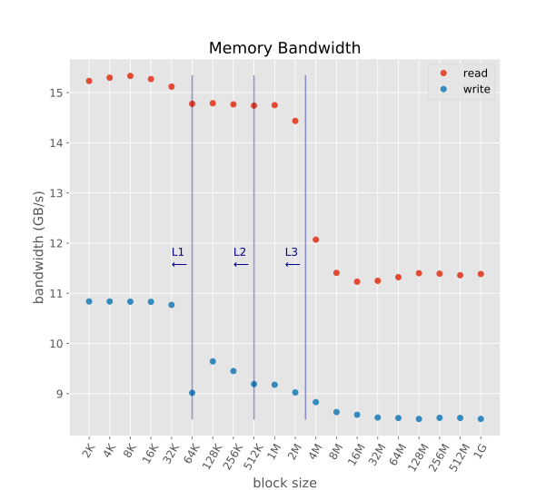
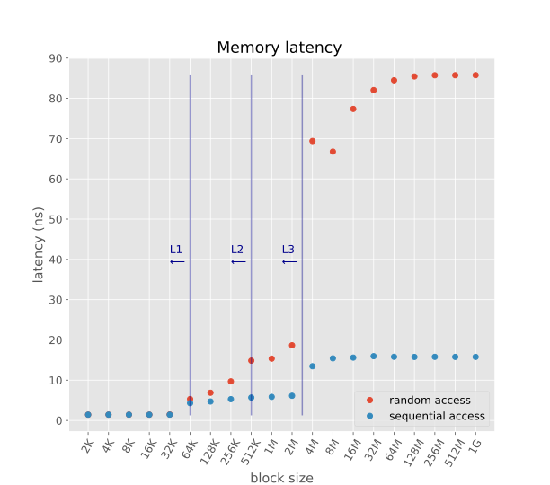

# Low Level Memory Benchmark

These are the results of a low level memory benchmark (written in C) on my laptop.

Laptop manufacturer specs:

  - Lenovo - T460
  - CPU i5-6200U: 2.3GHz (0.43 ns per cycle) (2 cores with hyperthreading)
  - L1 cache 64 KB, hit rate 4 cycles = 1.72 ns
  - L2 cache 512 KB, hit rate 10 cycles = 4.3 ns
  - L3 cache 3072 KB, hit rate 40 cycles = 17.2 ns
  - RAM DDR3-3200: 32GB, 1600 MHz (1.25 ns per cycle), CAS Latency 16 cycles, Total latency = CAS latency x cycle = 16*1.25 = 20 ns, Throughput 25.6 GB/s

Benchmarks run using the software [lmbench](http://lmbench.sourceforge.net/).

## Summary plots (details below)

## Benchmarks details:

  - Bandwidth (read), [bw_mem_rd](http://lmbench.sourceforge.net/man/bw_mem_rd.8.html). Allocate the specified amount of memory, zero it, and then time the reading of that memory as a series of integer loads and adds. Each 4-byte integer is loaded and added to accumulator. 

    [Results](memory_read_bandwidth.csv) (block size in MB, bandwith in MB/s)
  - Bandwidth (write),[bw_mem](http://lmbench.sourceforge.net/man/bw_mem.8.html). Allocate twice the specified amount of memory, zero it, and then time the copying of the first half to the second half. 

    [Results](memory_write_bandwidth.csv) (block size in MB, bandwith in MB/s)
  - Latency (sequential access), [lat_mem_rd](http://lmbench.sourceforge.net/man/lat_mem_rd.8.html). Run two nested loops. The outer loop is the stride size of 128 bytes. The inner loop is the block size. For each block size, create a ring of pointers that point backward one stride. Traverse the block by `p = (char **)*p` in a for loop and time the load ladency over block. 

    [Results](memory_seq_latency.csv) (block size in MB, latency in ns)
  - Latency (random access). Like above, but with a stride size of 16 bytes. 

    [Results](memory_random_latency.csv) (block size in MB, latency in ns)

