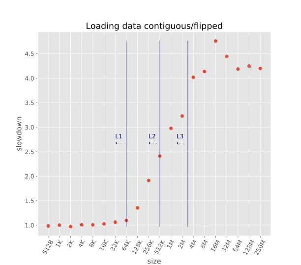

# Python Memory Benchmark

These are the results of a very basic memory benchmark (written in Python) on my laptop.

Laptop manufacturer specs:

  - Lenovo - T460
  - CPU i5-6200U: 2.3GHz (0.43 ns per cycle) (2 cores with hyperthreading)
  - L1 cache 64 KB, hit rate 4 cycles = 1.72 ns
  - L2 cache 512 KB, hit rate 10 cycles = 4.3 ns
  - L3 cache 3072 KB, hit rate 40 cycles = 17.2 ns
  - RAM DDR3-3200: 32GB, 1600 MHz (1.25 ns per cycle), CAS Latency 16 cycles, Total latency = CAS latency x cycle = 16*1.25 = 20 ns, Throughput 25.6 GB/s


## Summary plot (details below)


## Benchmarks details:

  - Create on disk a collection of `N` numpy arrays of size `S` from 2^9 to 2^28 bytes for all powers of two in between, that is from 512B up to 256MB. The arrays are of data type `float64`. Given that each `float64` item is 8-bytes, this means the arrays are of length `L` from 8 to 33,554,432.
  - Load the whole collection in memory by reading it in a single numpy array of size (`N`,`L`) (*good*) or (`L`,`N`) (*bad*). The corresponding loop is 

    ```python
    # good loop
    for idx in range(N):
        ts[:, idx] = np.load(file)
    ```

    ```python
    # bad loop
    for idx in range(N):
        ts[idx, :] = np.load(file)
    ```
  - Time the *bad* and the *good* loop
  - Results files are named `result_N_S` for each `N` and `S`. Each result file contains (size, time bad (s), time good (s)).
  - The plot above shows the ratio between the *bad* and the *good* timing as a function of `S` for `N=30`. 
