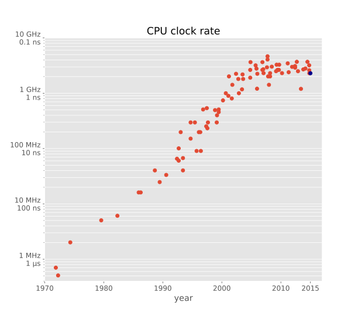
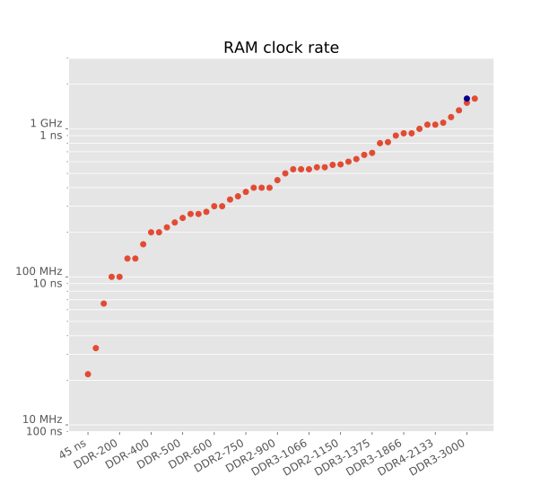
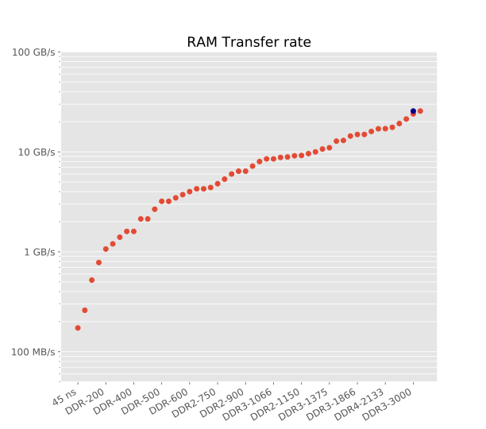
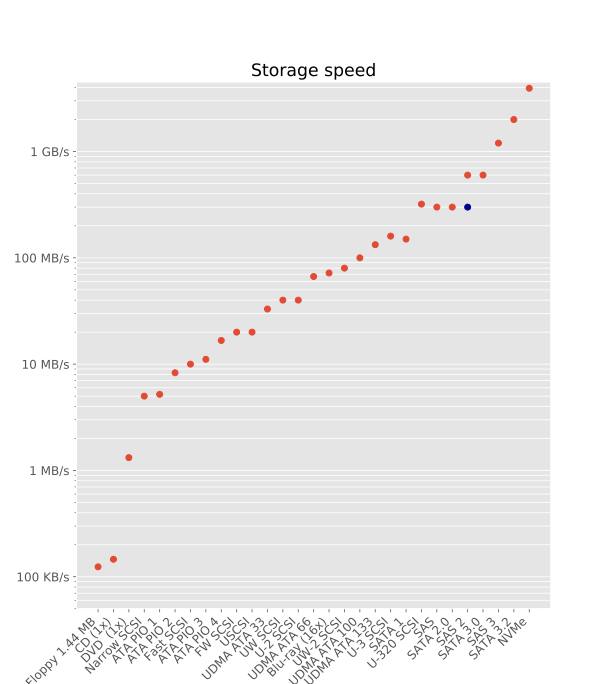

# Speeds

Plots and data (source: Wikipedia) showing speed of CPU, RAM, and storage media over the years.

Blue dots represent my laptop:
  - Lenovo - T460
  - CPU i5-6200U: 2.3GHz (0.43 ns per cycle) (2 cores with hyperthreading)
  - L1 cache 64 KB, hit rate 4 cycles = 1.72 ns
  - L2 cache 512 KB, hit rate 10 cycles = 4.3 ns
  - L3 cache 3072 KB, hit rate 40 cycles = 17.2 ns
  - RAM DDR3-3200: 32GB, 1600 MHz (1.25 ns per cycle), CAS Latency 16 cycles, Total latency = CAS latency x cycle = 16*1.25 = 20 ns, Throughput 25.6 GB/s

## CPU clock rate

## Memory (RAM) clock rate

## Memory (RAM) transfer rate

## Storage media access rate

